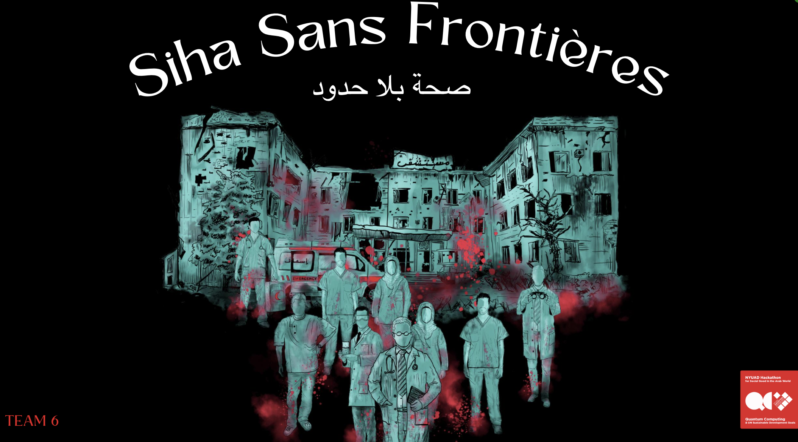
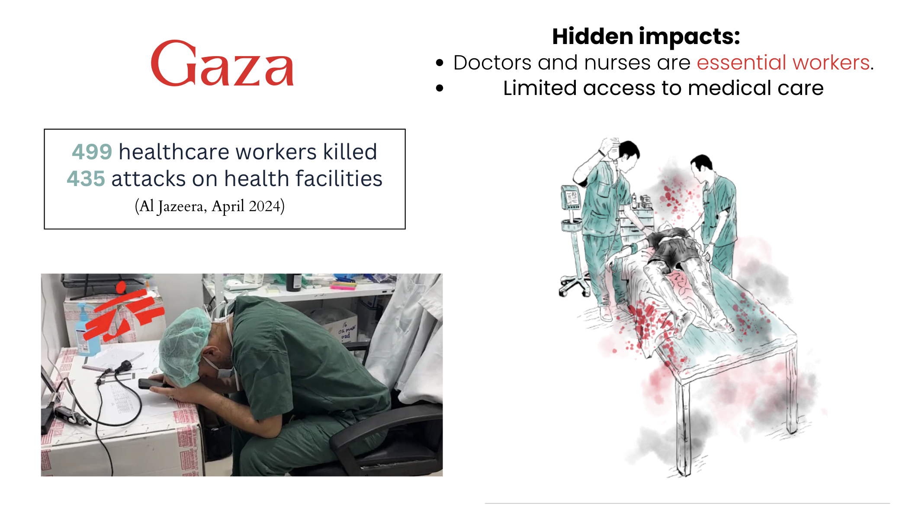
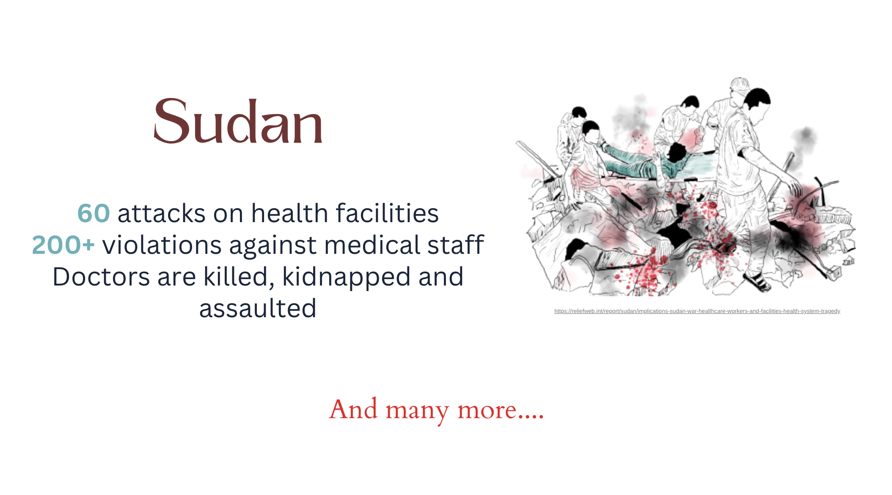
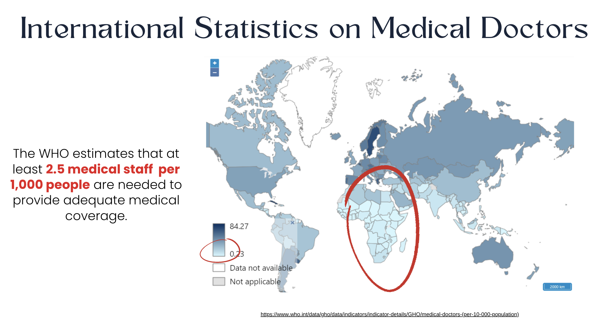
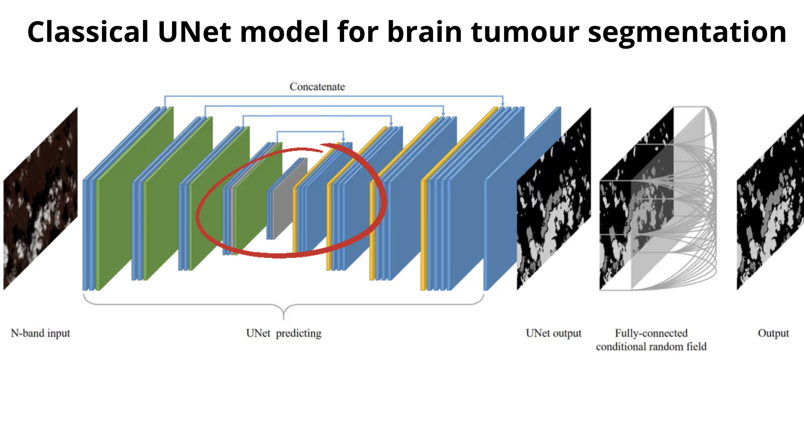
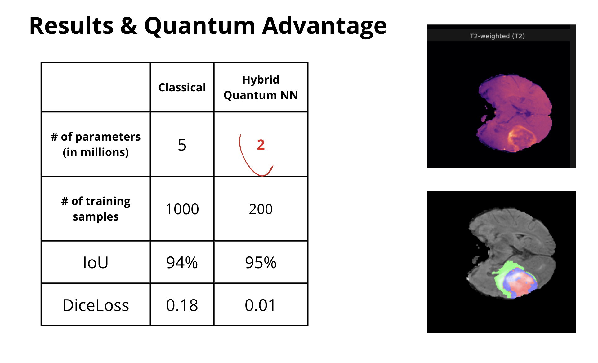
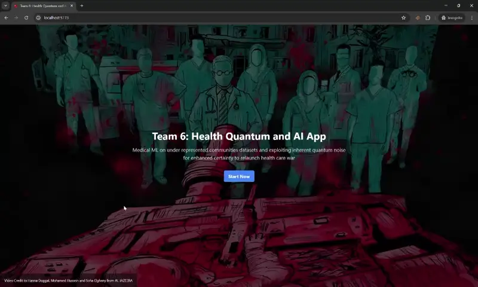

# Siha Sans Frontières / صحة بلا حدود

### Table of Content
- [Siha Sans Frontières / صحة بلا حدود](#siha-sans-frontières--صحة-بلا-حدود)
    - [Table of Content](#table-of-content)
- [About Project](#about-project)
- [Objective](#objective)
- [Case Study](#case-study)
    - [Data collection:](#data-collection)
  - [Application of Quantum Computing](#application-of-quantum-computing)
- [Conclusion](#conclusion)
- [Demo](#demo)
- [Credit](#credit)
  - [Participants](#participants)
  - [Mentors](#mentors)

# About Project

Siha Sans Frontières / صحة بلا حدود  leverages quantum computing to radically transform healthcare for underrepresented communities. Unlike traditional AI models trained on data primarily from the global north, which often fail when applied to diverse populations of the Global South, leading to dangerous misdiagnoses, our initiative focuses on enhancing AI fairness and customization. We are pioneering the use of quantum noise to improve the robustness of medical applications, thereby boosting the reliability and accuracy of health diagnostics. Our dual goals aim to not only tailor health AI technologies for global demographics but also advance medical research in Quantum Machine Learning, ultimately increasing the certainty and efficacy of medical imaging—a vital step that could fundamentally change the way medical imaging is used worldwide.

# Objective
Our solution optimizes the diagnostic process with an intuitive app engineered for rapid, precise, and customized medical diagnoses. This innovative tool not only expedites the analysis of imaging data but also guarantees that each diagnosis is finely tuned to meet the specific health needs and conditions of diverse patient populations, especially those from historically underserved areas.

# Case Study

### Data collection: 
 **Datasets:** We utilized the inclusive dataset from the Brain Tumor Segmentation (BraTS) Challenge 2023: Glioma Segmentation in Sub-Saharan Africa Patient Population (BraTS-Africa), which focuses on a demographic traditionally underrepresented in medical research. By incorporating this dataset, we enhance the accuracy and relevance of our AI models for glioma segmentation in African patients. To further advance our project, we have integrated quantum computing techniques to enhance the certainty of our diagnostic tools, ensuring that medical professionals can deliver more precise and reliable healthcare solutions to their patients
 Reference: (https://arxiv.org/abs/2305.19369)

## Application of Quantum Computing 
In our project, we utilized the Quantum Classical UNet model specifically designed for brain tumor segmentation. This model is a pioneering integration of classical deep learning techniques with quantum computing elements, and it plays a crucial role in our research efforts.

This approach aims to exploit the inherent quantum noise to enhance certainty,  our model not only speeds up the process of brain tumor segmentation but also improves the robustness of the results. This ensures that medical professionals can have greater confidence in the AI-supported diagnostics, allowing them to make better-informed decisions for treatment planning.

# Conclusion
By harnessing the power of quantum computing, we are not just processing medical data faster; we are making it more reliable and accurate. This innovation marks a crucial advancement in the use of AI in healthcare, setting a new standard for how medical data is analyzed and utilized in clinical settings. It underscores our commitment to pushing the boundaries of what's possible in medical technology and improving patient outcomes through more precise and reliable diagnostic tools.

# Demo

# Credit
This project was developed and will be presented for the Quantum Computing Hackathon at NUYAD for the year 2024

## Participants
- [Ibrahim Elmetwalli](https://www.linkedin.com/in/ibrahim1202?utm_source=share&utm_campaign=share_via&utm_content=profile&utm_medium=android_app), University of Science and Technology at Zewail City
- [Vincent Olagbemide](https://linkedin.com/in/vincent-olagbemide), University of Derby
- Ekaterina Pankovets, EPFL
- Amine Ghebreziabiher, Khalifa University | New York University Abu Dhabi
- Shaikha Aysha AlNuaimi, Ajman University
- [Rama Rami Ziad Hasiba](https://www.linkedin.com/in/ramahasiba/),  An-Najah National University
- [Imane Hamzaoui](https://www.linkedin.com/in/imane-hamzaoui-667514199/), NYUAD, ESI Algiers
- [Jheel Chetan Thanki](https://www.linkedin.com/in/jheel-thanki-616579283/), NYUAD

## Mentors
- [Bakhao Dioum](https://www.linkedin.com/in/bakhao-dioum-a20897257/), University of Lille
- [Sachin Valera](https://sites.google.com/view/sachinvalera), NYUAD

Below is a picture of us:

