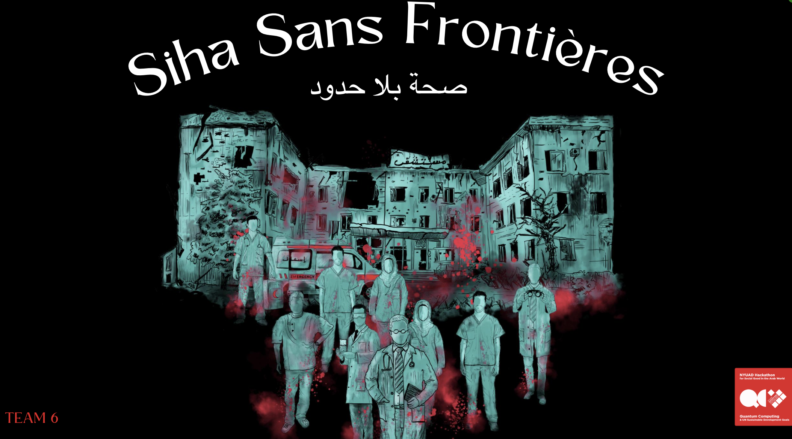

# Siha Sans Frontières / صحة بلا حدود
Table of Content
- About Project
- Objective
- Case Study
- Research
- Conclusion
- Project Folder Structure
- Start The App
- Credits
- References

# About Project

Siha Sans Frontières / صحة بلا حدود is pioneering the 

# Credit
This project was developed and will be presented for the Quantum Computing Hackathon at NUYAD for the year 2024

## Participants
- [Ibrahim Elmetwalli](https://www.linkedin.com/in/ibrahim1202?utm_source=share&utm_campaign=share_via&utm_content=profile&utm_medium=android_app), University of Science and Technology at Zewail City
- [Vincent Olagbemide](https://linkedin.com/in/vincent-olagbemide), University of Derby
- Ekaterina Pankovets, EPFL
- Amine Ghebreziabiher, Khalifa University | New York University Abu Dhabi
- Shaikha Aysha AlNuaimi, Ajman University
- [Rama Rami Ziad Hasiba](https://www.linkedin.com/in/ramahasiba/),  An-Najah National University
- [Imane Hamzaoui](https://www.linkedin.com/in/imane-hamzaoui-667514199/), NYUAD, ESI Algiers
- [Jheel Chetan Thanki](https://www.linkedin.com/in/jheel-thanki-616579283/), NYUAD

## Mentors
- [Bakhao Dioum](https://www.linkedin.com/in/bakhao-dioum-a20897257/), University of Lille
- [Sachin Valera](https://sites.google.com/view/sachinvalera), NYUAD

Below is a picture of us:

